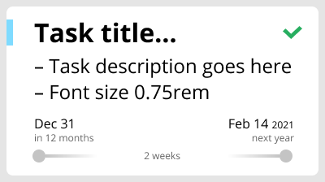
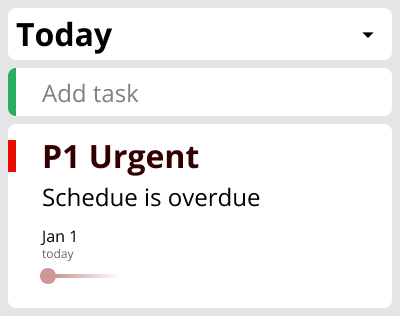
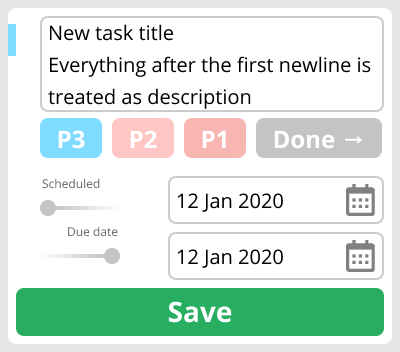

# Todo Mockup

We're making a Kanban ToDo app with a few column and three levels of prioritization. Each task has two date fields and sorted automatically depending on the schedule date.

```js
task = {
  id: uuid.required,
  title: string.required,
  completed: boolean.required,
  priority: oneOf([1, 2, 3]).required,
  description: string, // markdown, multi-line
  dueDate: string, // date-like string
  sheduleDate: string, // same
  // optional
  position: number, // if time permits so one can rearrange cards
}

task.defaultProps = {
  completed: false,
  priority: 1,
}
```

```css
/** colors **/
--red: #e80d00;
--orange: #ff851b;
--blue: #7fdbff;
```

```js
PRIORITIES = {
	1: { title: 'P1', color: '--red' }
	2: { title: 'P2', color: '--orange' }
	3: { title: 'P3', color: '--blue' }
}
```

# Stack

- https://github.com/facebook/react - for components
- https://github.com/apollographql/react-apollo - for data loading
- https://github.com/ReactTraining/react-router - routing and UI state
- https://github.com/atlassian/react-beautiful-dnd for drag and drop
- https://github.com/formium/formik - forms
- https://github.com/jquense/yup - validation
- https://github.com/datejs/Datejs - human date parser
- https://github.com/wojtekmaj/react-calendar - dropdown calendar
- https://github.com/rexxars/react-markdown - for markdown

# Interface

- The app loads all tasks at once and sorts them once they are loaded.
- This way we don't need to worry about having additional models on the backend.
- If we hide the `Done` tasks- we can load only incomplete tasks.
- This is debateable but shouln't be a problem unless someone creates billion cards, and we can test things sooner.

```gql
{ tasks { id title ... }}
```

- When creating/editing a task we display all fields, but pre-fill `scheduledDate` depending on a column.
- Users can change data and the card could end up in a different column after save.
- New card goes to the top of the list so it's not confusing
- State in url, active column, active card, calendar, etc.
- On the mobile phone we see only one column, so the app shows the resulting column the card is added to.
  - We store the active column in the url like so `/:column/:task_uuid(/calendar)` so we know which column to display when the screen is small
- I propose `apollo-graphql` with optimistic updates turned on, so after validation in the frontend we can be almost sure the actual data will be correct and update interface right away.
- Generate `uuid` in the frontend as well
- When one starts dragging a card on the mobile phone, replace the column view with slots to drop the card into:

```
+----------+
| Backlog  |
+----------+
| Today    |
+----------+
| Tomorrow |
+----------+
| Schedule |
+----------+
| Done     |
+----------+
```

- Probably worth color-coding the columns
- When card needs to be scheduled use an additional route to display the calendar `/tasks/id/schedule` this way the state is easy to manage and until the user enters the date the card stays where it was
- When creating a card in scheduled column without the date we should drop it to the `Backlog` and let user decide, if time allows - add an `Are you sure?` dialog
- Cards are split per column by their `id` and if time permits – `position`:

```js
state: {
  cards: {
    uuid10: { id: 'uuid10', column: 'backlog', title: 'Hello' },
    uuid11: { .... },
    ...
  },
  columns: {
    backlog: [ uuid10, uuid11, ... ],
    today: [ uuid20, uuid21, ... ],
    tomorrow: [ uuid30, uuid31, ... ],
    scheduled: [ uuid40, uuid41, ... ],
    done: [ uuid50, uuid51, ... ],
  }
},
```

- The idea is to fetch a flat list from the server and "hydrate" the state:
  - Each key in the `tasks` object equals `task.id` for this key. This would allow us a direct access to each task using `task[taskId]` without searching through the array.
  - `column` is referenced front the the `card` as well. This makes it easier to work with the cards and columns since you know which column it resides in.

# `TaskCard`

Component that displays `task`



- `title` is always displayed in full
- `description` is cut off so it's not too long, rendered using markdown
- `priority` is color coded
- `completed` fades out priority 50% and displays the `completed` icon in the corner
- `sheduleDate` and `dueDate` are displayed without the year if the year is current
- Human-readable time to/from each of the dates
- If both `sheduleDate` and `dueDate` are present display human-readable estimates amount of time
- When there is not enough width date lines go one under another, similar to [task-create-edit.png](task-create-edit.png)
- Fluid width, no maximum width, defined by the column container
- Draggable

# `CardColumn`

Component that displays a stack of `TaskCard` + `AddTask`, see [column.png](column.png) and [board.png](board.png)



- On mobile we display only one column and column title becomes a dropdown menu to switch between columns
- Clicking `AddTask` opens `TaskForm` component, same when you click the card
- When dragging the card on the desktop one sees the marker where the card was dragged from and where it lands
- EXTRA: In the first version cards are auto-sorted, later we could add `position`. Then cards will be ordered by `position` which is scoped to a column. New card will have `position: 0`, so it is always at the top.

# `TaskBoard`

One can use board as simple scheduler, cards with no near dates, today, tomorrow, and due later.


- Cards are auto-sorted based on `scheduledDate` and `completed` using the following rules, they are applied top to bottom:

  - no `scheduledDate` - `Backlog`
  - `scheduledDate` is `today` - `Today`
  - `scheduledDate` is `tomorrow` - `Tomorrow`
  - `scheduledDate` exists and not `[today, tomorrow]` - `Scheduled`
  - `completed`, with any dates – `Done`

- Dragging card from one column to another changes it's `scheduledDate`, and sets/clears `completed` if applicable:

  - `Backlog` - clear `scheduledDate`, `completed: false`
  - `Today` - set `scheduledDate` to `today`, `completed: false`
  - `Tomorrow` - set `scheduledDate` to `tomorrow`, `completed: false`
  - `Scheduled` - set `completed: false`, display the date popup if `scheduledDate` is `[ null, today, tomorrow ]`

- Due date can only be changed manually

# `TaskForm`

This is what the user sees when they click the card or `Add task`



- There is only one self-expanding text area for both title and description, everything after the first newline is considered as description.
- `Add task` prefills `scheduledDate` depending on a column:
  - `Backlog` - nothing is prefilled
  - `Today` - `scheduledDate` is set to today
  - `Tomorrow` - `scheduledDate` is set to tomorrow
  - `Scheduled` - `scheduledDate` is not set but when you try to save you are shown a warning and you can change the date or the card lands in `Backlog`. If you enter today's or tomorrow's date, the card lands in the respective column.
- Card is highlighted after creation so it can be easily seen.
- On the mobile the view switches to the column the card is created in
  - The simplest way to do this is via `CSS`, so the last column has `.active` class and the other ones are hidden when the viewport is too small.
  - We store the active column in the url like `/:column/:task_uuid(/calendar)` but it only changes what is visible on mobile devices
- They can enter dates manually or via dropdown once they focus in a field
- Manual entry is very fast on the desktop as you can just type `13` or `monday` and it will be recognized.
- By default priority is `P3` (low)
- Card can be completed right away then it will be added on the top of the `Done` column

# Concerns

- `dueDate` does not affect anything, we should at least highlight overdue cards
- `startDate` is a better way for `scheduledDate` should be named
- Original version did not have `Done` column but I see no reason keeping the `Done` items in sight. We could even hide the `Done` column and treat is as an `Archive` if we need to restore something
- Task splitting could be done on the backend as well

# Estimates

Tasks are estimated in scores not hours. `3` is a "`standard task`" that you know how to do. And if the coast is clear you do one before lunch, one after and pick up a couple of smaller ones along the way. `5` is something you are not so sure about or maybe it needs to be broken down into smaller tasks.

## Day 1 - Data Handling

- Project Setup - 3
- Data loading - 3
- Data splitting - 2

## Day 2 - `TaskCard`

- TaskCard component - 1
- Subcomponents for priority, dates - 2
- Responsive styles - 2

## Day 3 - `TaskColumn`

- TaskColumn component - 3
  - Display Cards nicely
- Add dropdown for mobile - 2
- Add task component - 3

## Day 4 - `TaskBoard`

- Board layout with multiple columns - 2
- Mobile version - 2
- Add drag-n-drop - 2
- Add placeholders - 2
- Mobile drop target - 2

## Day 5 - `TaskForm`

- `TaskForm` component - 3
- Error handling - 3
- Create/edit card - 3

## Day 6 - Card Creation

- Card created with no date - 2
- Card created for today - 2
- Card created for tomorrow - 2

## Day 7 - Card Creation 2

- Scheduled card creation - 2
- Scheduler popup - 3
- Calendar - 3

## Day 8 - Done Column

- Make sure unscheduled Tasks display popup when dropped in the schedules column - 3
- Done column - 3

## EXTRA: Positioning

- Add position column - 2
- Allow drag and drop withing a column - 3

# Figures


